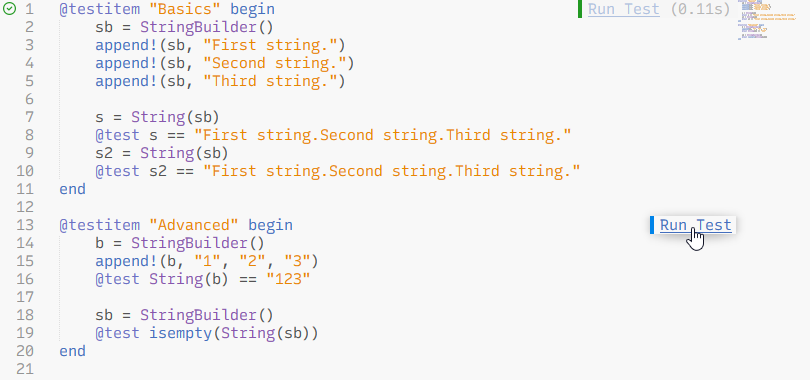

# LSP-julia

[](https://github.com/sublimelsp/LSP-julia/blob/master/LICENSE)

A plugin for the LSP client in Sublime Text with support for the [Julia language server](https://github.com/julia-vscode/LanguageServer.jl).


## Requirements & Installation

The following should be installed:

* A [Julia](https://julialang.org/) installation
  > [!NOTE]
  > If the `julia` executable is not in your PATH, you need to provide the full path to the executable in the LSP-julia package settings.
* The [Julia package](https://packagecontrol.io/packages/Julia) from Package Control
* The [LSP](https://packagecontrol.io/packages/LSP) and [LSP-julia](https://packagecontrol.io/packages/LSP-julia) packages from Package Control
* Optionally the [Terminus](https://packagecontrol.io/packages/Terminus) package from Package Control for a basic Julia REPL integration and the ability to run blocks of code with a key binding

When a Julia file is opened for the first time after installing LSP-julia, the language server will automatically be installed with the Julia package manager. This can take a few minutes.


## Features

The Julia language server supports most of the standard LSP features like auto-completion, documentation on hover, goto definition, and diagnostics (linting).

> [!IMPORTANT]
> Most features require that a folder was opened in Sublime Text and will not work in single file mode.

LSP-julia provides additional commands which are available from the command palette:

| Command label | Key binding | Description |
| ------------- | ----------- | ----------- |
| LSP-julia: Change Current Environment | none | Select the Julia project environment you are working in. The packages from this environment are used by the language server to provide autocomplete suggestions and for diagnostics/linting. Dependent on the number of packages, it might take a while for the server to do a package indexing process in the background, after switching to a different environment. |
| LSP-julia: Documentation | none | Search the Julia documentation[^1] and open the results in a tab. You can also right-click on a word in a Julia file and select "Show Documentation" from the context menu to open the corresponding documentation page. |
| LSP-julia: Open Julia REPL in Panel[^2] | none | Open a Julia REPL, started in the directory of the active file, or focus if already running. |
| LSP-julia: Open Julia REPL in Tab[^2] | none | Same as above, but use a normal tab instead of the bottom panel for the REPL. |
| LSP-julia: Select Code Block | none | Select the function or code block at the current cursor position. For multiple active cursors, only the topmost cursor position is taken into account. |
| LSP-julia: Run Code Block[^2] | <kbd>Alt</kbd>+<kbd>Enter</kbd> | If text is selected, run it in a Julia REPL. Otherwise, run the code block containing the current cursor position and move curser to the next block. |
| LSP-julia: Run Code Cell[^2] | <kbd>Alt</kbd>+<kbd>Shift</kbd>+<kbd>Enter</kbd> | If text is selected, run it in a Julia REPL. Otherwise, run the code cell containing the current cursor position and move curser to the next cell. Code cells are signalized with a specially formatted comment at the start of a line: `##`, `#%%` or `# %%`. |
| LSP-julia: Run Testitem | none | Show a quick panel with all available `@testitem`s in Julia files (see description below). |

[^1]: The documentation pages are dynamically generated from docstrings in Julia base, the standard library and in Julia packages, not from the official documentation on the Julia website.
[^2]: Only available if you have the Terminus package installed.

To add or adjust key bindings for the commands, run *Preferences: Key Bindings* from the command palette and modify the user file on the righthand side.
For an example refer to the [Default.sublime-keymap](Default.sublime-keymap) file in this repository, and for the command names from this package see [LSP-julia.sublime-commands](LSP-julia.sublime-commands).

### Run individual test items

LSP-julia has a special feature which allows to run individual testsets from a Julia package directly from the editor UI.

For this to work, the tests must be contained within a `@testitem` block, which is basically a replacement for `@testset`.
For an example see the screenshot below or read the detailed description at https://github.com/julia-vscode/TestItemRunner.jl#writing-tests.

A `@testitem` can be executed via the "Run Test" link shown in an annotation on the righthand side of the editor, or with the "LSP-julia: Run Testitem" command from the command palette.
Test failures and errors will be shown as annotations at the position in the code where they occured.
Currently there is no cancelling for the running `@testitem`s implemented, so make sure that the tests finish in a finite amount of time or manually close potential Julia processes from the task manager if you accidentally added an infinite loop.

> [!NOTE]
> The `@testitem` feature only works in [project environments](https://docs.julialang.org/en/v1/manual/code-loading/#Project-environments), i.e. you must have opened a folder in the sidebar which contains a *Project.toml* (or *JuliaProject.toml*) file with a `name` and `uuid` field.
>
> `@testitem`s have an isolated scope. The package to be tested is loaded implicitly through `using`. To access unexported symbols, either export them or call them by prepending the module name (for example `MyPackage.foo()`).

If you want to disable this feature completely, you can toggle off the following entry in the LSP-julia settings (*Preferences: LSP-julia Settings* from the command palette):
```json
{
  "initializationOptions": {
    "julialangTestItemIdentification": false
  }
}
```




## Frequently Asked Questions

### I have deleted or cleaned up my `.julia` directory. Now the language server doesn't start anymore.

Delete the `LSP-julia` folder at the following location:
* on Windows: `%LocalAppData%/Sublime Text/Package Storage/LSP-julia`
* on Linux: `~/.cache/sublime-text/Package Storage/LSP-julia`
* on macOS: `~/Library/Application Support/Sublime Text/Package Storage/LSP-julia`

Then restart Sublime Text and open a Julia file to re-install the language server.

### The embedded Julia REPL doesn't start if Julia was installed via juliaup.

This seems to be a bug/limitation in the Python 3.3 API environment, which is used by the Terminus package, when resolving symlinks.

As a workaround, you can manually specify the full path (without symlink) to the Julia executable in the LSP-julia settings (*Preferences: LSP-julia Settings* from the command palette).
Here is an example on Windows:

```jsonc
{
    "julia_executable_path": "C:\\Users\\<username>\\.julia\\juliaup\\julia-1.9.0+0.x64.w64.mingw32\\bin\\julia.exe",
}
```
